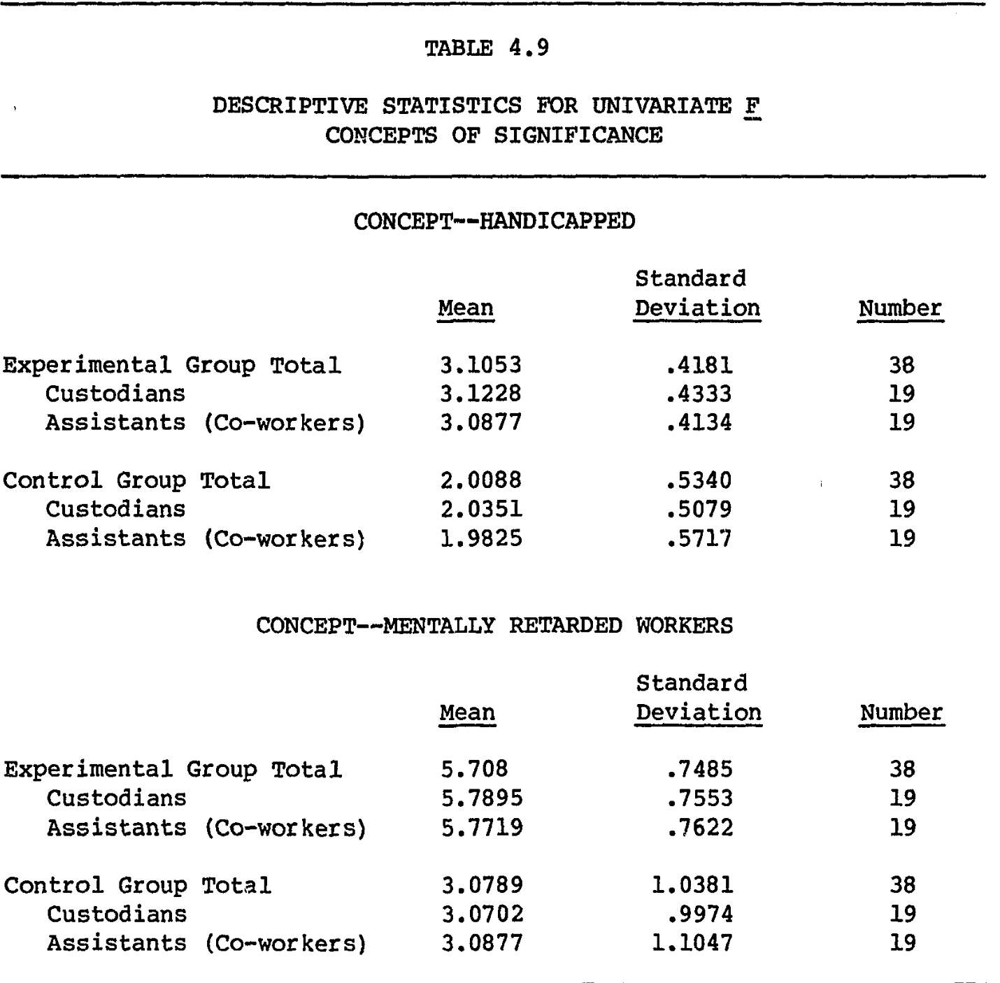
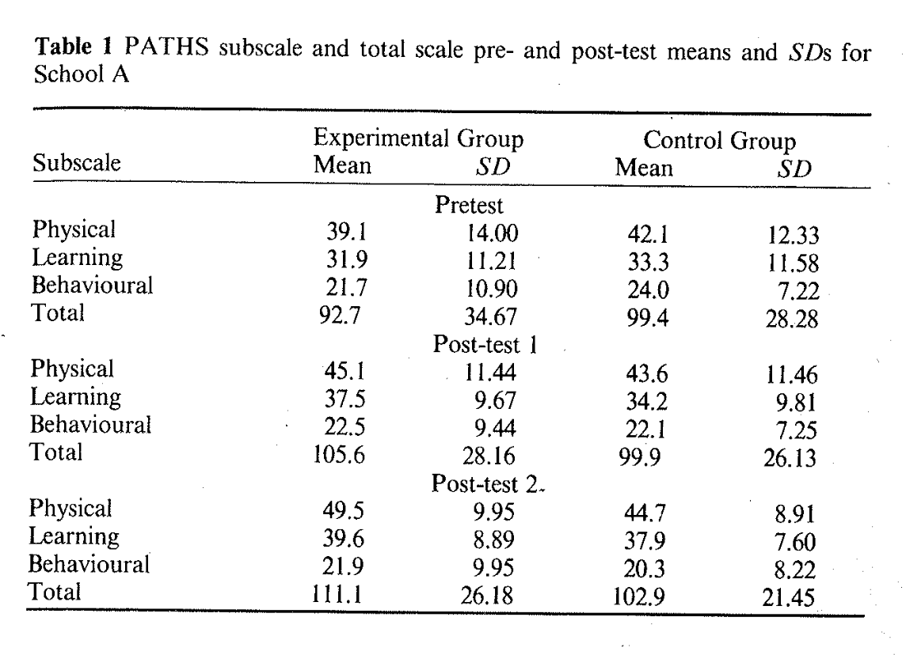
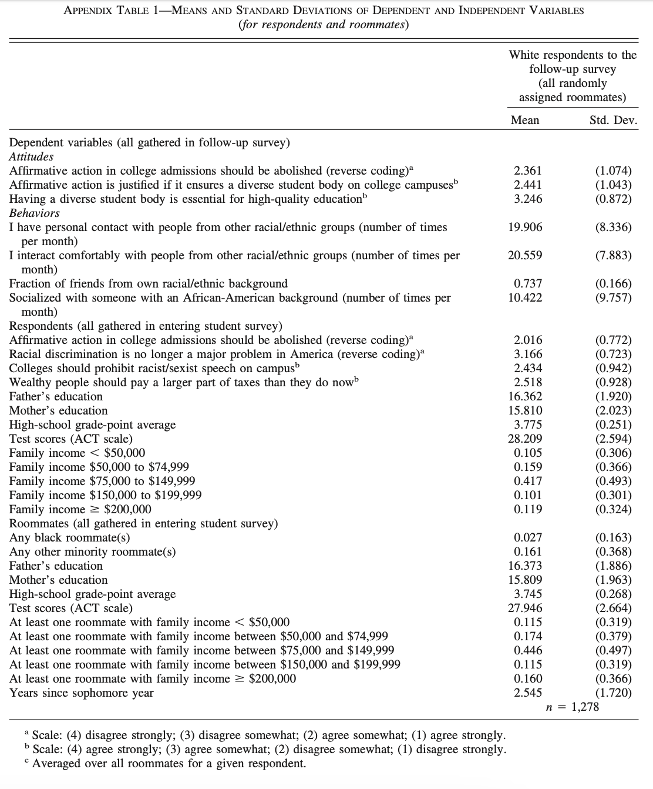
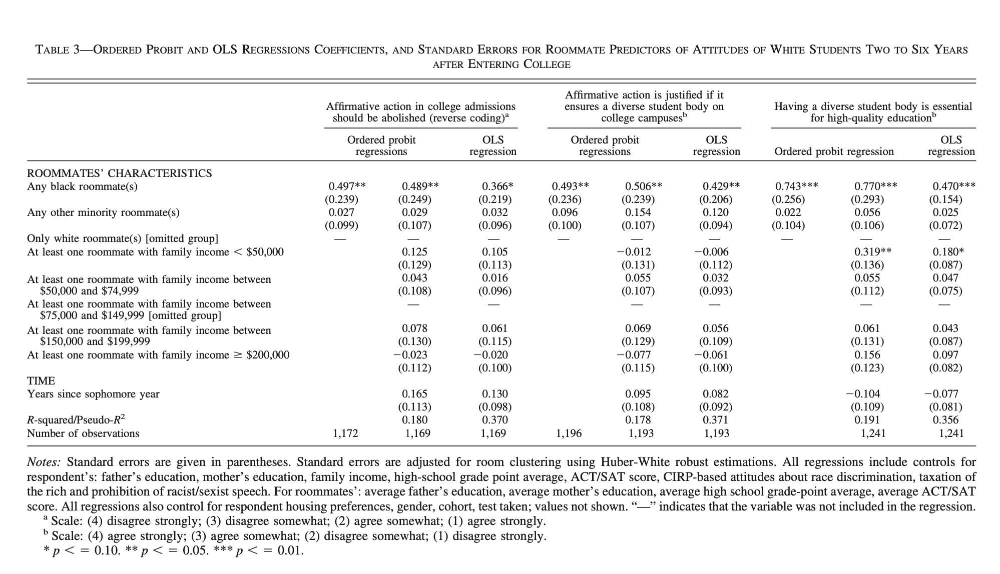
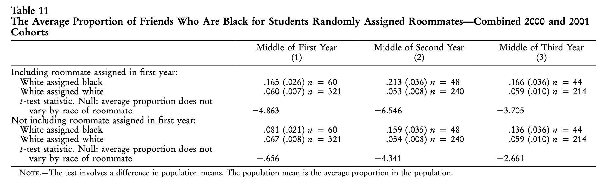
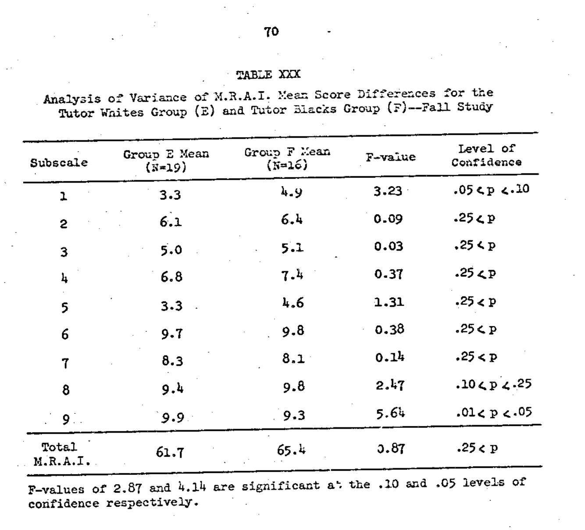

## 1 Introduction

This vignette explains how to use the `d_calc` and `var_d_calc` functions to convert a study's results into an estimate of standardized mean difference (SMD), along with its associated variance and standard error.

We demonstrate with examples from [The Contact Hypothesis Re-evaluated](https://doi.org/10.1017/bpp.2018.25) (henceforth TCHR).

The contact hypothesis meta-analytic dataset is included, with small adjustments, in this package as `PaluckMetaSOP::contact_data`.

TCHR's supplementary materials are available on the [OSF](https://osf.io/ttpvy/?view_only=https://osf.io/ttpvy/?view_only=) if you want to read the studies this vignette talks bout.

### 1.1 Standardized Mean Difference and Variance

An SMD is the difference in average outcomes between the treatment and control groups divided by the standard deviation (SD) of the outcome.

$$SMD = \frac{M_1-M_2}{SD}$$

See [this page from the Cochrane Collaboration](https://handbook-5-1.cochrane.org/chapter_9/9_2_3_2_the_standardized_mean_difference.htm) for more discussion.

We calculate SMD with `d_calc` and its variance using `var_d_calc`. The standard error (SE) of an SMD is the square root of its variance.

A vector of SMDs and and a vector of SEs are the core components of meta-analysis, which we discuss in our "doing meta-analysis" vignette.

Some studies plainly report $M_1$, $M_2$, and $SD$, which makes calculating an SMD easy. Others report statistical summaries, which then need to be converted into an SMD using some formulas. `d_calc` implements a selection of these formulas drawn from chapters 12 and 13 of [Cooper, Hedges, and Valentine (2009)](https://www.scholars.northwestern.edu/en/publications/the-handbook-of-research-synthesis-and-meta-analysis-2nd-edition).

In one case — the difference in proportions estimator — we depart from those equations, which we'll explain in section 3.2.4 of this vignette.

### 1.2 d vs ∆

There are two basic ways to standardize your SMD. If you divide $M_1 - M_2$ by the SD of the entire sample, your estimator is called [Cohen's d](https://resources.nu.edu/statsresources/cohensd). If you use an estimated SD from just the control group, you get [Glass's ∆](https://www.statisticshowto.com/glasss-delta/) (Delta). The Paluck lab generally prefers Glass's ∆ because we're interested in the efficacy of interventions relative to the population's baseline state, and we think that treatment might (in some cases) change the underlying distribution of the outcome.

In the rest of this vignette, we'll use ∆ as our symbol for SMD.

When the SD of the control group isn't available but the SD of the entire population is, we use the SD of the entire population. When neither is available, or can't be figured out from a paper's results, we might have a problem. We discuss these issues more in our "hard cases" vignette.

## 2 `d_calc` and `var_d_calc`

### 2.1 `d_calc`

`d_calc` is a function that takes (up to) five parameters and returns an estimate of either ∆ or d, depending on what you standardize by. The first two parameters are essential, and the next three are necessary depending on the value of the first parameter.

The five parameters are:

-   1: `stat_type`, where you put the kind of statistical results you're converting into ∆. its possible values are:

    -   `d` or `s_m_d`, for when a paper provides its own estimate of d/∆/SMD.

    -   `d_i_m` for difference in means.

    -   `d_i_d` for difference in differences.

    -   `reg_coef`, `regression`, or `beta`, for when you have the regression coefficient associated with treatment.

    -   `t_test` or `T-test` for when you have a t-test.

    -   `f_test` or `F-test` or `F` for when you have an F-test.

    -   `odds_ratio` for odds ratio.

    -   `log_odds_ratio` for log odds ratio.

    -   `d_i_p` for a difference in proportions.

    -   `unspecified_null` or `unspecified null` for when you can't figure out a precise estimate, but know that the overall effect was null.

-   2: `stat`, the value of the statistic that you're reporting or converting into SMD.

-   3: `sample_sd`, the standard deviation that you're using to standardize your estimate.

    -   This is generally a necessary input, but not when the stat type already tells you something about the variance of the outcome (`d`, `SMD`, `F test`, `t test`, `odds ratio`, or `log odds ratio`).

-   4: `n_t` and 5: `n_c`, the sample sizes for treatment and control.

    -   These are necessary only for converting `F test` and `t test` results into SMDs.

Run `PaluckMetaSOP::d_calc` without parentheses to see all the conversion formulas.

### 2.2 `var_d_calc`

`var_d_calc` takes three inputs:

-   1: `d`, which is typically generated by `d_calc.`

-   `n_t` and `n_c`, the sample sizes for treatment and control.

The function first turns this into an (uncorrected) estimate of variance via

${\sigma^2_1} = (\frac{n_t + n_c}{n_t * n_c}) + (\frac{d^2}{2} * (n_t + n_c))$

And then applies a correction for small study variance called hedge's *g:*

$g = 1 - (3/((4 * (n_t + n_c - 2)) - 1))$

And the final variance estimate is

$\sigma^2 = g^2 * \sigma^2_1$

## 3. Calculating $\Delta$ and $\sigma^2$ in practice

### 3.1 The easy cases: difference in means, difference in differences, and, regression coeffcients

#### **3.1.1 difference in means**:

[DiTullio (1982)](https://www.proquest.com/docview/303259182),is a study of workplace integration programs aimed at reducing prejudice towards people with developmental disabilities. Here is table 4.9 (p. 76):

{width="500"}

We took "CONCEPT--MENTALLY RETARDED WORKERS" to be the dependent variable that best captured attitudes towards the outgroup:[^1] $M_1 = 5.708$; $M_2 = 3.0789$; and $SD_C = 1.0381$.

[^1]: This step can be tricky because some papers present many outcomes that are all plausible measures of the true quantity of interest. Whenever possible, we advise pre-specifying which outcomes or categories of outcome to code before you start collecting data. But in situations like this, the meta-analyst needs to make a judgment call about which outcome is substantively closest to the true quantity of interest. Alternatively, you can average all measures together, or record them all separately. For TCHR, we took one dependent variable per study.

Therefore,

$$\Delta = \frac{5.708 - 3.0789}{1.0381} = 2.533$$

Here is code to calculate ∆, variance, and SE:

```         
DiTullio_results <- d_calc(stat_type = "d_i_m", stat = 5.708 - 3.0798, sample_sd = 1.0381)

ditullio_variance <- var_d_calc(d = DiTullio_results, n_t = 38, n_c = 38)

ditullio_se <- sqrt(ditullio_variance)
```

Two notes about this effect size. First, you'll see a "what" column in our dataset that, for this study, says "Table 4.9 (p. 79)." This is a signpost for any interested readers about where in the paper to find the statistics you've converted into ∆, variance, and SE. Your future self will thank you for recording signposts like this!

Second, ∆ = 2.533 is a very large effect size**.** Most effect sizes we've calculated have been between -1 and 1.

**3.1.2 d_i_d (difference in differences):**

Some studies present the mean outcomes for each group at both baseline and posttest. [Clunies-Ross & O'Meara (1989)](https://aps.onlinelibrary.wiley.com/doi/abs/10.1080/00050068908259566) tested an "attitude change programme" comprised of "controlled vicarious contact with peers with disabilities, disability simulations, and success oriented group experiences" (p. 271). Here is table 1 (p. 279):

{width="500"}

In these cases, we subtract the baseline values from the posttest values for both treatment and control, and divide the resulting difference by the SD of the control group at baseline. This procedure creates more precise estimates because it controls for baseline differences between the two groups.

$$
∆ = \frac{(111.1-92.7)-(102.9-99.4)}{28.28} = 0.5268741
$$

This was for school A, and we repeated the same process for school B as a separate effect size estimate.

In code:

```         
dessel_school_a_effects <- d_calc(stat_type = "d_i_d", stat = (111.1-92.7)-(102.9-99.4), sample_sd = 28.28)

dessel_school_a_var <- var_d_calc(d = dessel_school_a_effects, n_t = 15, n_c = 15)

dessel__school_a_se <- sqrt(dessel_school_a_var)
```

#### **3.1.3 Regression coefficient (beta):**

In a bivariate regression of the relationship between treatment status and outcome, the $\beta$ coefficient is is equivalent to the difference in means between the groups. Calculating the SD from a regression table can be tricky, but some studies report both $\beta$ and the standard deviation for the outcome.

[Boisjoly et al. (2006)](https://www.aeaweb.org/articles?id=10.1257/aer.96.5.1890) which tested the effects of being randomly assigned a black or other race roommate on four measures of political and social attitudes for white college students. Here is Appendix table 1 (p. 1903):\

{width="500"}

Here, for the main dependent variable ("Affirmative action in college admissions should be abolished (reversed)"), we have the SD for the entire population of white students who were randomly assigned roommates (1.073) rather than just the control group. For this study, our SMD estimate is going to be Cohen's d rather than Glass's ∆.

Instead of a difference in means, we have linear regression coefficients from table 3, column 3 (p. 1899):[^2]

[^2]: Here, a reader might note that $\beta$ imperfectly captures the mean difference between groups because the model includes controls; the intercept here is a (perhaps hypothetical) person whose values are set to zero for all values, not just the treatment indicator. As part of a project that evolved into TCHR, we emailed the authors to ask to replicate the original data, but unfortunately data were not available due to the researchers' agreement with the university. (We thank Greg Duncan kindly for his help.) $\beta$ is the best thing we have given these limitations, we think, because converting [ordered probit](https://en.wikipedia.org/wiki/Ordered_probit) coefficients to ∆ is (as far as we know) an intractable problem. The resulting number might be an overestimate of the effect size, but not in a way that substantively changes our beliefs about the world. We get ∆ = 0.341, which is a small to moderate size by convention, and the coefficient is significant at the p \< 0.05 level. That's approximate correspondence. Effect size estimates are just that, estimates.

{width="500"}

The authors tell us the size of the treatment and control groups on p. 1895: "of the 1,278 white respondents, 35 were assigned at least one black roommate, 98 were assigned at least one Asian roommate, 40 were assigned at least one Hispanic roommate, and 69 were assigned at least one “other race” roommate. The rest were assigned white roommates."

We then calculated two separate SMDs, one corresponding to the effect on white students on being assigned a black roommate and one for being assigned "any other minority roommate:"

```         
# Ns
black_roommate_treatment_n <- 35
other_minority_treatment_n <- 98 + 40 + 69 # 207
boisjoly_n_c <- 1278 - 35 - 98 - 40 - 69 # 1036

# black roommates
Bois_d_black_roommates <- d_calc(stat_type = "reg_coef", stat = .366, sample_sd = 1.074)
Bois_var_black_roomamtes <- var_d_calc(d = Bois_d_black_roommates, 
                                       n_t = black_roommate_treatment_n, 
                                       n_c = boisjoly_n_c)
Bois_se_black_roommates <- sqrt(Bois_var_black_roomamtes)

# other minority roommates
Bois_d_other_roommates <- d_calc(stat_type = "reg_coef", stat = .032, sample_sd = 1.074)
Bois_var_other_roomamtes <- var_d_calc(d = Bois_d_black_roommates, 
                                       n_t = other_minority_treatment_n, 
                                       n_c = boisjoly_n_c)
Bois_se_other_roommates <- sqrt(Bois_var_other_roomamtes)
```

### 3.2 Converting statistical summaries into SMDs

Sometimes, papers report summary statistics that require more complex conversions. [Cooper, Hedges, and Valentine (2009)](https://www.scholars.northwestern.edu/en/publications/the-handbook-of-research-synthesis-and-meta-analysis-2nd-edition) provide formulas for converting t-tests, F-tests, log odds ratios, and odds ratios into ∆. Here we'll show examples for the t-test and F-statistic from TCHR. However, instead of presenting odds ratios and log odds ratios examples (for starters, there weren't any in our TCHR data), we'll introduce a novel estimator for converting differences in proportions to ∆. (We explore this estimator more in our d_i_p vignette.)

#### 3.2.1 t-test

The standard conversion from a t-test to Cohen's d is $d = t * \sqrt\frac{n_t + n_c}{n_t * n_c}$.

[Camargo, Stinebrickner, and Stinebrickner (2010)](https://doi.org/10.1086/653831) also study the effects of interracial roommate assignments, but in the special environment of Berea college, a tuition-free college in Kentucky that abjures the use of roommate questionnaires when assigning roommates.[^3]

[^3]: Boisjoly et al., by contrast, worked with the admissions office of the studied school to control for all non-random determinants of roommate assignment.

Table 11 (p. 882) presents the following results on friendship composition over time:

{width="500"}

We take the latest possible result ("Middle of Third Year") for the effect that includes the roommate assigned in first year.[^4] So our `stat` is `t = -3.705`. We take our Ns from that table as well: `n_t = 44` and `n_c = 214`.

[^4]: In a world where roommate assignment reduces prejudice, we would expect to see this partly manifesting as likelihood of white students' still being friends with their initially assigned black roommates.

In code:

```         
Camargo_d <- d_calc(stat_type = "t_test", stat = 3.705, 
                                n_t = 44, n_c = 214)
                                
camargo_var <- var_d_calc(d = Camargo_d, n_t = 44, n_c = 214)

camargo_se <- sqrt(camargo_var)
```

#### 3.2.1 F-test

When we are comparing (only) two variances, the F statistic is equivalent to the square of the t-test. As a result, the formula for converting F to ∆ is the same as with t to ∆ except with the F inside the square root:

$d = \sqrt{F * \frac{n_t + n_c}{n_t * n_c}}$

[Sayler (1969)](https://www.proquest.com/docview/302483961?pq-origsite=gscholar&fromopenview=true) studied interracial contact for college students at local community centers. Here's table XXX (p. 70):

{width="500"}

In code:

#### 3.2.4 log odds ratios, odds ratios, and a novel difference in proportions estimator

Finally, **log odds ratios** can be converted to d via $OR * \sqrt{\frac{3}{pi}}$

while **odds ratios** can be converted to d via $log(OR) * \sqrt{\frac{3}{pi}}$.

Neither of these estimators came up in TCHR, though they did in subsequent meta-analyses. However, we try to avoid converting odds ratios or log odds ratios to ∆ whenever possible. As [Gomilla (2021)](https://psycnet.apa.org/record/2020-71596-001) writes, any give odds ratio can correspond to multiple possible effect sizes depending on the variance of the dependent variable. As a solution to this, while we were working on [Prejudice Reduction: Progress and Challenges](https://www.annualreviews.org/content/journals/10.1146/annurev-psych-071620-030619), Donald P. Green proposed a solution that treats those proportions as draws form a Bernoulli distribution and calculates variance and SD accordingly.

The SD of the Bernoulli distribution $\sqrt{ p (1-p)}$, where p is the proportion of some event (for Glass's ∆, the proportion in the control group).

Say some event occurs in 10% of control group participants and 15% of treatment group participants. In that case:

$\Delta = \frac{.15  -.1}{\sqrt{.1 (1. - .1})} = \frac{.05}{\sqrt{.09}} = 0.166$.

When using `d_calc` to convert a difference in proportions to ∆, put the difference between as the `stat` and the rate of incidence of the event in the control group as `sample_sd`.

In code: `d_calc("d_i_p", .05, .1)` .

We discuss this estimator in more detail in a separate vignette.

### 3.3 Unspecified nulls (for when you have nothing precise but a "no effect")

Some studies, e.g. [Hall 1969](https://ir-api.ua.edu/api/core/bitstreams/8b53661b-99c5-4a2f-9e2d-603bfffb3eb0/content), don't tell you exactly what effect they find, just that it wasn't significant. We set all of these cases to ∆ = 0.01 so we can include them in our main analyses. You can set the null to 0.0, or 0.001, or anything that substantively communicates "there was no effect" and get basically the same result.

`d_calc("unspecified_null")` will always return 0.01.

## 4 How we use `d_calc` and `var_d_calc` in practice

When we wrote TCHR, we recorded every use of `d_calc` and `var_d_calc` for every study in a script, and then copied pasted the resulting values into our final dataset. That script looked like the above scripts in this vignette: a lot of objects whose results we manually copied and pasted into the dataset.

For our [next](https://www.annualreviews.org/content/journals/10.1146/annurev-psych-071620-030619) [two](https://osf.io/preprints/psyarxiv/xgbzj) meta-analyses, we incorporated `d_calc` and `var_d_calc` directly into our analysis scripts with the `mapply` and `dplyr::mutate` functions. Here is how that looks when applied to the contact hypothesis data:

```{r sv_d_var_d_se_d_creation_script, eval=F}

library(dplyr)

dat_with_new_ds <-  PaluckMetaSOP::contact_data |> 
  select(-c(d, se_d, var_d)) |>  # delete vars and then reproduce them
  mutate(d = mapply(
          FUN = d_calc,
          stat_type = statistic,
          stat =  unstand,
          sample_sd = sd_c,
          n_t = n_t,
          n_c = n_c),
        var_d = mapply(
          FUN = var_d_calc,
          d = d,
          n_t = n_t,
          n_c = n_c)) |> 
    mutate(se_d = sqrt(var_d))
```

This script uses variables in the dataset as inputs for our two custom functions and returns a dataset with `d`, `var_d`, and `se_d`.

This approach will ultimately save you a fair bit of time, reduce a possible source of user error by eliminating the copy and paste step, and make a larger portion of your workflow computationally reproducible.

## Further reading:

See [this page on SMDs](https://handbook-5-1.cochrane.org/chapter_9/9_2_3_2_the_standardized_mean_difference.htm) from the Cochrane collaboration and the `escalc`[documentation](https://wviechtb.github.io/metafor/reference/escalc.html) from the `metafor` package for more information and discussion.

## 
