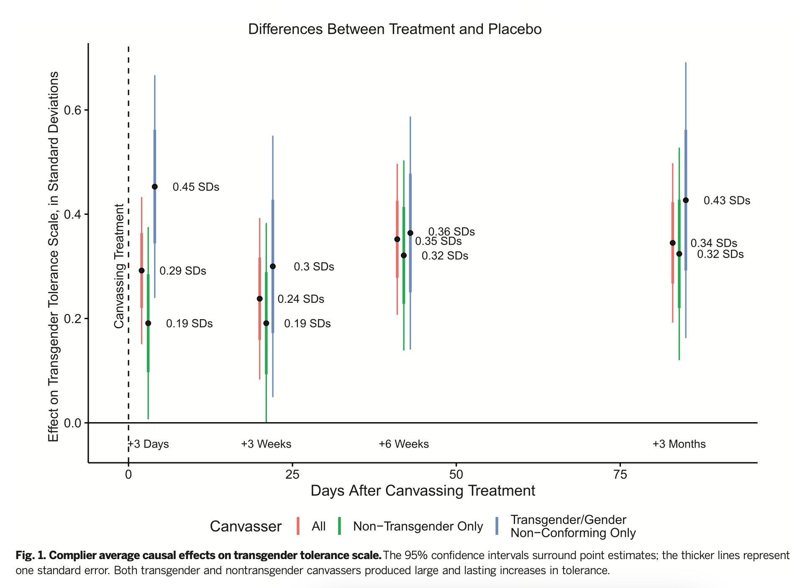

### Introduction

Our vignette on calculating ∆ from a given paper's results should, we hope, cover the vast majority of cases you're likely to encounter. However, our meta-analytic datasets have each had edge cases that required bespoke solutions. This vignette walks through two problem scenarios : figuring out ∆ when the meta-analytic outcome is different than the one the paper focuses on; and estimating $SD_C$ from a regression table. We'll illustrate with examples from [The Contact Hypothesis Re-evaluated](https://www.cambridge.org/core/journals/behavioural-public-policy/article/contact-hypothesis-reevaluated/142C913E7FA9E121277B29E994124EC5).

In general, we make all available efforts to figure out a "good enough" estimate of ∆, imperfect data notwithstanding. However if we really can't figure something out, we'll omit a study or just include it as part of a vote counting procedure.[^1]

[^1]: I.e., a tally of statistically significant positive, statistically significant negative, and null results. A recent paper called vote counting procedures "antiquated" ([Mathur & VanderWeele 2018](\^[Some meta-analytsts think that vote counting procedures are "antiquated" (Mathur & VanderWeele 2018))) and we agree that statistical significance is not obviously a good signal of whether a given piece of evidence is meaningful or substantive. However, vote counting can sometimes provide a novel way to look at things, e.g. a higher number of nulls than expected is a "hoop test" ([Collier 2011](https://polisci.berkeley.edu/sites/default/files/people/u3827/Understanding%20Process%20Tracing.pdf)) against publication bias.

### When *your* estimand isn't the paper's

[Brookman and Kalla (2016)](science.org/doi/10.1126/science.aad9713) is a landmark study of how a brief conversation with canvassers on trans issues can durably alter transphobic attitudes. Figure 1 displays the main results:

{width="600"}

These results are already presented in terms of SDs of change, which makes the meta-analyst's life much easier. However, our meta-analysis was specifically about the effects of intergroup contact, rather than intergroup contact + other treatments. Admittedly, many studies in our experiment tested intergroup contact in conjunction with other treatments, e.g. a conversation about race issues ([Sorensen 2010](https://www.proquest.com/docview/761442605?pq-origsite=gscholar&fromopenview=true)) or an invitation to ask a member of the outgroup questions about her life ([Evans 1976)](https://psycnet.apa.org/record/1976-27859-001). However, in this case, we already know from Figure 1 that most of the change in attitudes is independent of intergroup contact; at a 3 month follow-up, a conversation with a cis canvasser led to a reduction in transphobic attitudes of d = 0.32, vs. 0.43 for trans canvassers. So if we were to take the estimate of d = 0.43 as our estimate of the effects of intergroup contact, that would probably be an overestimate because it would also be capturing the effects of an independently effective treatment.

If whether a subject talked to a trans or cis canvasser was randomly assigned, then $d = 0.43-0.32 = 0.11$ would be an unbiased, simple estimate of the effects of talking to a trans person above and beyond the effects of the conversation. However, when we emailed David and Josh to ask about this, they told us that assignment wasn't so simple because it varied across places where conversations took place ("turfs" in the lingo of the paper), and that it would take several hours of work for the authors to recreate the randomizations and account for all of this with randomization inference. This did not seem to us like a reasonable request on our part just to get an answer that, in all likelihood, was going to be very similar to $d = 0.11$. So we did end up just taking as our estimate, imperfect though it may be.

A few notes on this. First, when in doubt, write to the authors; papers do not communicate everything researchers know about their subject. Second, although $d=0.11$ is a comparatively small effect size (the overall meta-analytic estimate in this paper was $∆ = 0.27$), we consider this one of the strongest pieces of evidence for when and where contact reduces prejudice for a few reasons:

-   Three months of measurement delay after treatment ends was an unusually long gap.

-   This article had open data and a detailed pre-analysis plan, which were both rarities in the assembled dataset.

-   This paper's careful design allowed us to disentangle the effects of intergroup contact vs. the other elements of treatment. Other papers in our dataset did not allow for these kinds of fine-grained measurements, so they might be overestimates of the effects of contact (if the non-contact elements of treatment also meaningfully affected the outcomes). This is a tricky problem for meta-analysis because the standard meta-analytic models

```{r simulation}
library(dplyr)
library(gt)

# Function to run a single simulation
run_simulation <- function(n) {
  # Generate data
  dat <- data.frame(
    treatment_status = rbinom(n = n, size = 1, prob = 0.5)
  ) |> 
    mutate(
      outcome = ifelse(treatment_status == 1, rnorm(n, 2, 1), rnorm(n, 1.5, 1)),
      cov_one = if_else(treatment_status == 1,
                        sample(2:5, replace = TRUE, size = n),
                        sample(1:4, replace = TRUE, size = n)),
      cov_two = if_else(treatment_status == 1,
                        rnorm(n, 5, 1),
                        rnorm(n, 3, 1))
    )
  
  # Calculate True Glass's Delta
  true_delta <- round(mean(dat$outcome[dat$treatment_status == 1]) - mean(dat$outcome[dat$treatment_status == 0]) / 
    sd(dat$outcome[dat$treatment_status == 0]),4)
  
  # Fit models and immediately summarize
  simple_model_summary <- summary(lm(outcome ~ treatment_status, data = dat))
  model_with_covs_summary <- summary(lm(outcome ~ treatment_status + cov_one + cov_two, data = dat))
  
  # Extract coefficients
  beta_simple <- simple_model_summary$coefficients["treatment_status", "Estimate"]
  beta_covs <- model_with_covs_summary$coefficients["treatment_status", "Estimate"]
  
  # Extract SE of intercept directly from summary objects
  se_intercept_simple <- simple_model_summary$coefficients["(Intercept)", "Std. Error"]
  se_intercept_covs <- model_with_covs_summary$coefficients["(Intercept)", "Std. Error"]
  
  # Calculate n_c
  n_c <- sum(dat$treatment_status == 0)
  
  # Estimate population SD using sqrt(n_c)
  estimated_sd_simple <- se_intercept_simple * sqrt(n_c)
  estimated_sd_covs <- se_intercept_covs * sqrt(n_c)
  estimated_delta_simple <- beta_simple / estimated_sd_simple
  estimated_delta_covs <- beta_covs / estimated_sd_covs
  
  # Return results
  return(data.frame(
    N = n,
    True_Glass_Delta = true_delta,
    simple_Delta = estimated_delta_simple,
    covs_Delta = estimated_delta_covs
  ))
}

# Function to run multiple simulations
simulate_effect_sizes <- function(n_values, num_simulations) {
  results <- lapply(n_values, function(n) {
    replicate(num_simulations, run_simulation(n), simplify = FALSE) |> bind_rows()
  }) |> bind_rows()
  return(results)
}

# Parameters for simulation
n_values <- c(50, 100, 500, 1000)
num_simulations <- 100

# Run simulations
simulation_results <- simulate_effect_sizes(n_values, num_simulations)

# Summarize the results and present in a table using gt()
simulation_results |> 
  group_by(N) |> 
  summarise(
    Avg_True_d = round(mean(True_Glass_Delta), 3),
    avg_simple_delta = round(mean(simple_Delta),3),
    Avg_Cov_d_Diff = round(mean(covs_Delta),3)) |> gt()

```

as we can see, this method basically works only if there are no covariates. once you have informative covariates, no good.

```{r t-test-sim}
library(PaluckMetaSOP)  # Assuming this library has the d_calc function for converting t-test to Cohen's d

# Function to run a single simulation
run_simulation <- function(n) {
  # Generate data
  dat <- data.frame(
    treatment_status = rbinom(n = n, size = 1, prob = 0.5)
  ) |> 
    mutate(
      outcome = ifelse(treatment_status == 1, rnorm(n, 2, 1), rnorm(n, 1.5, 1)),
      cov_one = if_else(treatment_status == 1,
                        sample(2:5, replace = TRUE, size = n),
                        sample(1:4, replace = TRUE, size = n)),
      cov_two = if_else(treatment_status == 1,
                        rnorm(n, 5, 1),
                        rnorm(n, 3, 1))
    )
  
  # Calculate true mean differences and SD for true Cohen's d
  mean_t = mean(dat$outcome[dat$treatment_status == 1])
  mean_c = mean(dat$outcome[dat$treatment_status == 0])
  sd <- sd(dat$outcome)
  true_cohen_d = (mean_t - mean_c) / sd
  
  # Fit models and immediately summarize
  no_covs_t_value <- summary(lm(outcome ~ treatment_status, data = dat))$coefficients["treatment_status", "t value"]
  covs_t_value <- summary(lm(outcome ~ treatment_status + cov_one + cov_two, data = dat))$coefficients["treatment_status", "t value"]
  
  # Calculate n_t and n_c
  n_t <- sum(dat$treatment_status == 1)
  n_c <- sum(dat$treatment_status == 0)
  
  # Convert t-values to Cohen's d using 'd_calc'
  cohen_d_simple <- d_calc(stat_type = "t_test", stat = no_covs_t_value, n_t = n_t, n_c = n_c)
  cohen_d_covs <- d_calc(stat_type = "t_test", stat = covs_t_value, n_t = n_t, n_c = n_c)
  
  # Return results
  return(data.frame(
    N = n,
    True_Cohen_d = true_cohen_d,
    Cohen_d_Simple = cohen_d_simple,
    Cohen_d_Covs = cohen_d_covs
  ))
}

# Parameters for simulation
n_values <- c(50, 100, 500, 1000)
num_simulations <- 100

# Function to run multiple simulations
simulate_effect_sizes <- function(n_values, num_simulations) {
  results <- lapply(n_values, function(n) {
    replicate(num_simulations, run_simulation(n), simplify = FALSE) |> bind_rows()
  }) |> bind_rows()
  return(results)
}

# Run simulations
simulation_results <- simulate_effect_sizes(n_values, num_simulations)

simulation_results |> 
  group_by(N) |> 
  summarise(
    Avg_True_Cohen_d = round(mean(True_Cohen_d), 3),
    t_to_d_simple = round(mean(Cohen_d_Simple), 3),
    t_to_d_with_covs = round(mean(Cohen_d_Covs), 3)
  ) |> gt()
```

This is closer,
