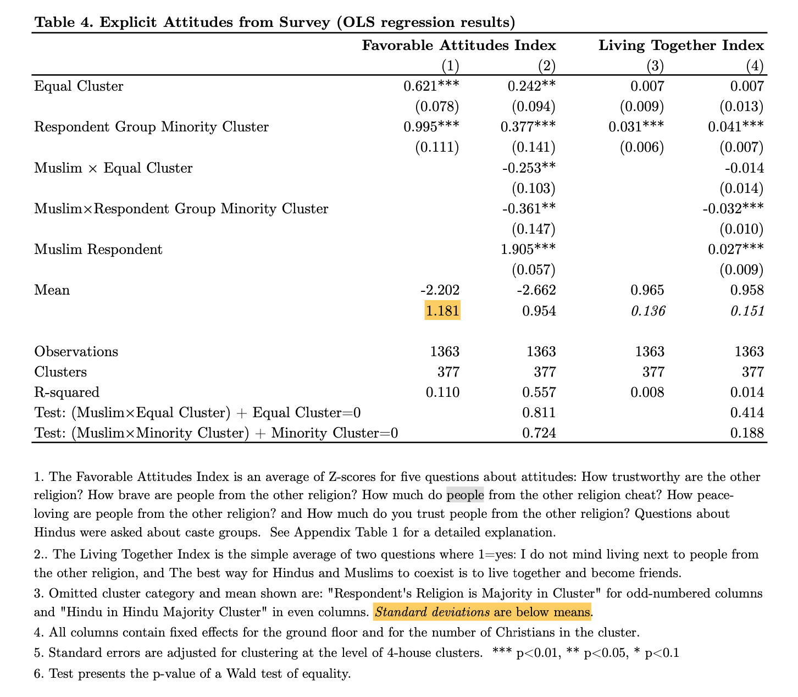

### Introduction

Our d-calc vignette on calculating ∆ from a given paper's results should, we hope, cover the vast majority of cases you're likely to encounter. However, each of our meta-analyses have had edge cases that required bespoke solutions. This vignette walks through two problem scenarios: figuring out ∆ when the meta-analytic outcome is different than the one the paper focuses on; and estimating an SMD from a regression table. We'll illustrate with examples from [The Contact Hypothesis Re-evaluated](https://www.cambridge.org/core/journals/behavioural-public-policy/article/contact-hypothesis-reevaluated/142C913E7FA9E121277B29E994124EC5) (TCHR from here on out).

In general, we make all available efforts to figure out a "good enough" estimate of ∆, imperfect data notwithstanding. However if we really can't figure something out, we'll omit a study or just include it as part of a vote counting procedure.[^1]

[^1]: I.e., a tally of statistically significant positive, statistically significant negative, and null results. A recent paper called vote counting procedures "antiquated" ([Mathur & VanderWeele 2018](\^[Some meta-analytsts think that vote counting procedures are "antiquated" (Mathur & VanderWeele 2018))) and we agree that statistical significance is not obviously a good signal of whether a given piece of evidence is meaningful or substantive. However, vote counting can sometimes provide a novel way to look at things, e.g. a higher number of nulls than expected is a "hoop test" ([Collier 2011](https://polisci.berkeley.edu/sites/default/files/people/u3827/Understanding%20Process%20Tracing.pdf)) against publication bias.

### When *your* estimand isn't the paper's

[Brookman and Kalla (2016)](science.org/doi/10.1126/science.aad9713) is a landmark study of how a brief conversation with canvassers on trans issues can durably alter transphobic attitudes. Figure 1 displays the main results:

{width="600"}

These results are already presented in terms of fractions of an SD, which makes the analyst's life much easier. However, our meta-analysis was specifically about the effects of intergroup contact, rather than intergroup contact + other treatments, and this study features a canvassing component that, as this figure shows, influences the dependent outcome independent of intergroup contact.

Admittedly, many studies in our experiment tested intergroup contact in conjunction with other treatments, e.g. a conversation about race issues ([Sorensen 2010](https://www.proquest.com/docview/761442605?pq-origsite=gscholar&fromopenview=true)) or an invitation to ask a member of the outgroup questions about her life ([Evans 1976)](https://psycnet.apa.org/record/1976-27859-001). However, in this case, we already know from Figure 1 that *most* of the change in attitudes is accounted for by the canvassing component; at a 3 month follow-up, a conversation with a cis canvasser led to a reduction in transphobic attitudes of d = 0.32, vs. 0.43 for trans canvassers. So the estimate of d = 0.43 as an estimate of the effects of intergroup contact would probably be an overestimate of the effects of intergroup contact by itself.

If whether a subject talked to a trans or cis canvasser was randomly assigned, then $d = 0.43-0.32 = 0.11$ would be an unbiased estimate of the effects of talking to a trans person above and beyond the effects of the conversation. However, when we emailed David and Josh to ask about this, they told us that assignment varied across places where conversations took place ("turfs"), and that it would take a fair bit of work for the authors to recreate the randomizations and account for all possible assignments with randomization inference. This did not seem to us like a reasonable request on our part just to get an answer that, in all likelihood, was going to be very similar to $d = 0.11$. So we took that as our estimate, imperfect though it may be.

A few notes on this. First, when in doubt, write to the authors; papers do not communicate everything researchers know about their subject. Second, although $d=0.11$ is a comparatively small effect size (the overall meta-analytic estimate in this paper was $∆ = 0.27$), we consider this one of the strongest pieces of evidence for when and where contact reduces prejudice for a few reasons:

-   Effects persisted for three months after treatment.

-   This article had open data and a detailed pre-analysis plan, which were both rarities in the assembled dataset and which increase our confidence in the estimate.

-   This paper's careful design allowed us to disentangle the effects of intergroup contact vs. the other elements of treatment. Other papers in our dataset did not allow for these kinds of fine-grained measurements, so they might be overestimates of the effects of contact if the non-contact elements of treatment also meaningfully affected the outcomes.

    -   This is a tricky problem for meta-analysis because the standard meta-analytic models only account for *statistical* sources of uncertainty. In other words, if you have one study that is unusually attentive to validity (e.g. on measurement error, reproducibility, or constraining researcher degrees of freedom), and another that takes no such steps, when you combine them in a meta-analysis, those quality features will not be taken into account unless they happen to produce more precise point estimates, which is not guaranteed. We generally account for these sorts of issues by running subgroup analyses. For instance, in TCHR, we separately meta-analyzed studies with and without a pre-analysis plan and found a substantial difference: ∆ = 0.016 for studies with a pre-analysis plan and ∆ = 0.451 for studies without.

Ultimately, a pooled effect is ultimately just one way to assess the quality of evidence produced by a literature and can be supplemented by other descriptions and analyses. One such strategy is to highlight the 'landmark' studies in depth, as we do in [Paluck et al. (2021)](https://www.annualreviews.org/content/journals/10.1146/annurev-psych-071620-030619). These studies "provide a glimpse of what a meta-analysis would reveal if we could weight studies by quality as well as quantity" (p. 14.19). If we had done so for TCHR, we would have highlighted this study as well.

### Calculating standardized mean difference from regression output

Some studies, particularly by economists, present results from a regression output. It can take some work to translate these results to a SMD.

Here is the results table from [Boisjoly et al. (2006)](https://www.aeaweb.org/articles?id=10.1257/aer.96.5.1890)

{width="600"}

As a preliminary remark, we default to translating the OLS results to an SMD rather than ordered probit coefficients. However, if this table was all you had to work with, there would be no straightforward way to calculate the standard deviation of the outcome because of the presence of control variables which soak up some of the variance.

We recommend you take the following steps.

First, read the entire paper, because information about the outcome's standard deviation might be reported somewhere else. In this paper, it's in appendix table 1:

{width="600"}

The same was true for [Barnhardt (2009)](https://www.povertyactionlab.org/evaluation/near-and-dear-evaluating-impact-neighbor-diversity-inter-religious-attitudes), where the SD was reported in table 4 in the appendix (we've highlighted the relevant section because it's relatively easy to miss):

{width="600"}

Second, if a simple regression model is reported without any controls, you can divide $\beta$ by $se$ to get the T-test, which can be converted to $d$ in a routinized way with `PaluckMetaSOP::d_calc`. (Alternatively, you can multiply the standard error of the intercept by the square root of N for the control group and get a reasonable estimate of the SD of the control group, but you're probably better off just converting to T.)

Third, if you really don't have either piece of information, email the authors to ask if the data can be made available to you, or if not, if they can calculate the standard deviation of the dependent variable (for the entire population for Cohen's dor just the control group for Glass's ∆).

Fourth, if you really can't find any of that and if the authors don't respond, you've come to a fork in the road. One answer is to discard the study on the grounds that you could not figure out a specific effect size. Another is to include it in a vote counting procedure. A third is to do your best with what you have, knowing that it might be a biased estimate.

TODO: wait for Maya to write back and then do whatever simulations or graphs make sense. maybe we plot the distribution of t-values? I think not. I think that's responding to an imaginary problem.

```{r simulation}
library(dplyr)
library(gt)

# Function to run a single simulation
run_simulation <- function(n) {
  # Generate data
  dat <- data.frame(
    treatment_status = rbinom(n = n, size = 1, prob = 0.5)
  ) |> 
    mutate(
      outcome = ifelse(treatment_status == 1, rnorm(n, 2, 1), rnorm(n, 1.5, 1)),
      cov_one = if_else(treatment_status == 1,
                        sample(2:5, replace = TRUE, size = n),
                        sample(1:4, replace = TRUE, size = n)),
      cov_two = if_else(treatment_status == 1,
                        rnorm(n, 5, 1),
                        rnorm(n, 3, 1))
    )
  
  # Calculate True Glass's Delta
  true_delta <- round(mean(dat$outcome[dat$treatment_status == 1]) - mean(dat$outcome[dat$treatment_status == 0]) / 
    sd(dat$outcome[dat$treatment_status == 0]),4)
  
  # Fit models and immediately summarize
  simple_model_summary <- summary(lm(outcome ~ treatment_status, data = dat))
  model_with_covs_summary <- summary(lm(outcome ~ treatment_status + cov_one + cov_two, data = dat))
  
  # Extract coefficients
  beta_simple <- simple_model_summary$coefficients["treatment_status", "Estimate"]
  beta_covs <- model_with_covs_summary$coefficients["treatment_status", "Estimate"]
  
  # Extract SE of intercept directly from summary objects
  se_intercept_simple <- simple_model_summary$coefficients["(Intercept)", "Std. Error"]
  se_intercept_covs <- model_with_covs_summary$coefficients["(Intercept)", "Std. Error"]
  
  # Calculate n_c
  n_c <- sum(dat$treatment_status == 0)
  
  # Estimate population SD using sqrt(n_c)
  estimated_sd_simple <- se_intercept_simple * sqrt(n_c)
  estimated_sd_covs <- se_intercept_covs * sqrt(n_c)
  estimated_delta_simple <- beta_simple / estimated_sd_simple
  estimated_delta_covs <- beta_covs / estimated_sd_covs
  
  # Return results
  return(data.frame(
    N = n,
    True_Glass_Delta = true_delta,
    simple_Delta = estimated_delta_simple,
    covs_Delta = estimated_delta_covs
  ))
}

# Function to run multiple simulations
simulate_effect_sizes <- function(n_values, num_simulations) {
  results <- lapply(n_values, function(n) {
    replicate(num_simulations, run_simulation(n), simplify = FALSE) |> bind_rows()
  }) |> bind_rows()
  return(results)
}

# Parameters for simulation
n_values <- c(50, 100, 500, 1000)
num_simulations <- 100

# Run simulations
simulation_results <- simulate_effect_sizes(n_values, num_simulations)

# Summarize the results and present in a table using gt()
simulation_results |> 
  group_by(N) |> 
  summarise(
    Avg_True_d = round(mean(True_Glass_Delta), 3),
    avg_simple_delta = round(mean(simple_Delta),3),
    Avg_Cov_d_Diff = round(mean(covs_Delta),3)) |> gt()

```

as we can see, this method basically works only if there are no covariates. once you have informative covariates, no good.

```{r t-test-sim}
library(PaluckMetaSOP)
library(gt)
# Assuming this library has the d_calc function for converting t-test to Cohen's d

# Function to run a single simulation
run_simulation <- function(n) {
  # Generate data
  dat <- data.frame(
    treatment_status = rbinom(n = n, size = 1, prob = 0.5)
  ) |> 
    mutate(
      outcome = ifelse(treatment_status == 1, rnorm(n, 2, 1), rnorm(n, 1.5, 1)),
      cov_one = if_else(treatment_status == 1,
                        sample(2:5, replace = TRUE, size = n),
                        sample(1:4, replace = TRUE, size = n)),
      cov_two = if_else(treatment_status == 1,
                        rnorm(n, 5, 1),
                        rnorm(n, 3, 1))
    )
  
  # Calculate true mean differences and SD for true Cohen's d
  mean_t = mean(dat$outcome[dat$treatment_status == 1])
  mean_c = mean(dat$outcome[dat$treatment_status == 0])
  sd <- sd(dat$outcome)
  true_cohen_d = (mean_t - mean_c) / sd
  
  # Fit models and immediately summarize
  no_covs_t_value <- summary(lm(outcome ~ treatment_status, data = dat))$coefficients["treatment_status", "t value"]
  covs_t_value <- summary(lm(outcome ~ treatment_status + cov_one + cov_two, data = dat))$coefficients["treatment_status", "t value"]
  
  # Calculate n_t and n_c
  n_t <- sum(dat$treatment_status == 1)
  n_c <- sum(dat$treatment_status == 0)
  
  # Convert t-values to Cohen's d using 'd_calc'
  cohen_d_simple <- d_calc(stat_type = "t_test", stat = no_covs_t_value, n_t = n_t, n_c = n_c)
  cohen_d_covs <- d_calc(stat_type = "t_test", stat = covs_t_value, n_t = n_t, n_c = n_c)
  
  # Return results
  return(data.frame(
    N = n,
    True_Cohen_d = true_cohen_d,
    Cohen_d_Simple = cohen_d_simple,
    Cohen_d_Covs = cohen_d_covs
  ))
}

# Parameters for simulation
n_values <- c(50, 100, 500, 1000)
num_simulations <- 100

# Function to run multiple simulations
simulate_effect_sizes <- function(n_values, num_simulations) {
  results <- lapply(n_values, function(n) {
    replicate(num_simulations, run_simulation(n), simplify = FALSE) |> bind_rows()
  }) |> bind_rows()
  return(results)
}

# Run simulations
simulation_results <- simulate_effect_sizes(n_values, num_simulations)

simulation_results |> 
  group_by(N) |> 
  summarise(
    Avg_True_Cohen_d = round(mean(True_Cohen_d), 3),
    t_to_d_simple = round(mean(Cohen_d_Simple), 3),
    t_to_d_with_covs = round(mean(Cohen_d_Covs), 3)
  ) |> gt()
```

This is closer,
